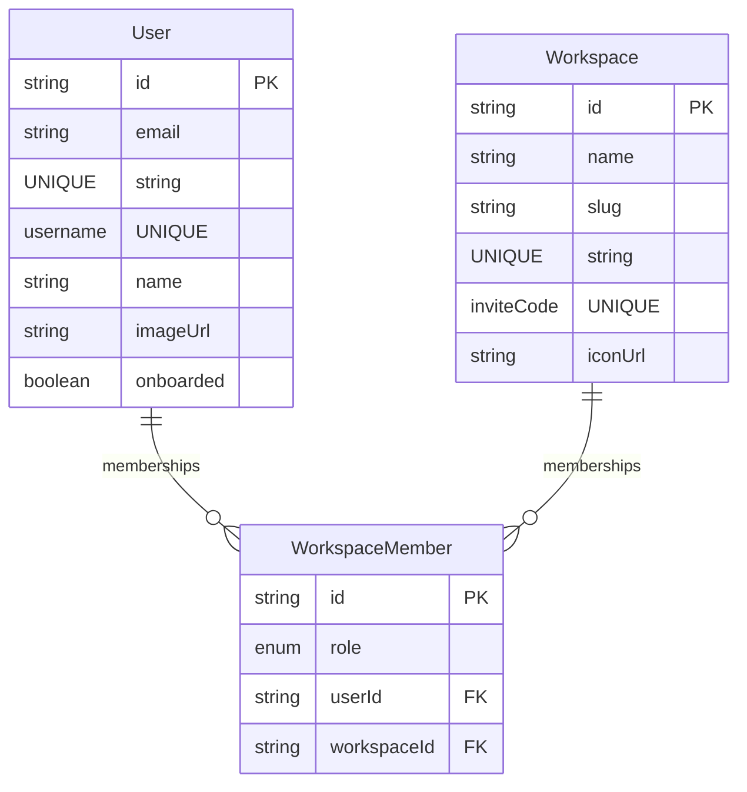

# 🏢 Workspace & Onboarding Architecture

This document describes the design, database schema, and endpoint actions for the Workspace management and User Onboarding flows in the Hermes platform.

---

## 1. Database Schema

The workspace architecture is built around three Prisma models: `User`, `Workspace`, and `WorkspaceMember`.



* **User**: Tracks profile values and onboarding status.
* **Workspace**: Contains the name, unique url slug, and a unique 8-character uppercase `inviteCode`.
* **WorkspaceMember**: Connects a `User` to a `Workspace` with a specific authorization `Role` (`OWNER`, `ADMIN`, `MEMBER`, `GUEST`). A composite unique constraint ensures a user has at most one membership per workspace.

---

## 2. Onboarding Flow

Onboarding is a step-by-step process that takes place before a user can access the main dashboards.

### Steps
1. **Username Choice**: The user picks a unique username (validated in real-time).
2. **Profile Picture**: The user supplies an avatar image URL (optional, defaults to a placeholder).
3. **Workspace Configuration**: The user has two options:
   * **Create a Workspace**: Enter a workspace name (e.g. "Acme Corp"), generating a new workspace, a unique slug, and a unique invite code. The user is assigned the `OWNER` role.
   * **Join a Workspace**: Enter an 8-character invite code of an existing team workspace. The user is assigned the `MEMBER` role.

### Transactional Atomicity
To prevent partial states (e.g. creating a user profile but failing to create or join their workspace), the backend runs both updates inside a Prisma database transaction (`tx`):

```typescript
// apps/api/src/modules/onboarding/onboarding.service.ts
return prisma.$transaction(async (tx) => {
  // 1. Update user profile details and mark onboarded = true
  const user = await tx.user.update({ ... });

  // 2. Either join the existing workspace or create a new one
  if (inviteCode) {
    // Look up and create a WorkspaceMember record
  } else if (workspaceName) {
    // Create a new workspace and Owner membership
  }
});
```

---

## 3. Joining Workspaces

Users can join workspaces at two points in their journey:

1. **During Onboarding**: (Explained above) by choosing the "Join Workspace" tab.
2. **Post-Onboarding**: From the active dashboard dropdown selectors (`WorkspaceHeader` and `SidebarRail`), or from the workspaces hub (`/workspaces`).
   * Clicking "Join Workspace" opens a modal prompting for the 8-character code.
   * On submission, it POSTs to `/api/v1/workspaces/join`.
   * On success, the frontend refetches the active workspaces list and redirects the browser directly to the new workspace's dashboard page.

---

## 4. Database Environments & Sync

The Hermes platform is designed to run in two modes:

### A. Local Docker-Compose Stack
When executing the application using Docker, all containers are orchestrated via `infra/docker/docker-compose.yml`.
* **Database**: Runs inside the `hermes-postgres` container, listening internally on port `5432` and exposed to the host machine on port **`5434`**.
* **Configurations**: The API container connects to `postgres:5432/hermes` with username/password credentials.

### B. Cloud Database Mode (NeonDB)
When running the development server locally on your host machine (outside Docker), the API reads `apps/api/.env`, which configures a connection to a cloud database (e.g., NeonDB).
* **Warning**: When switching between database environments (Docker container vs. cloud NeonDB), your browser's session cookie (`token`) may contain a user ID that does not exist in the other database. If you experience `500 INTERNAL_SERVER_ERROR` or foreign key violations on logins/actions, **sign out and sign back in** to generate a fresh cookie matching your active database.
